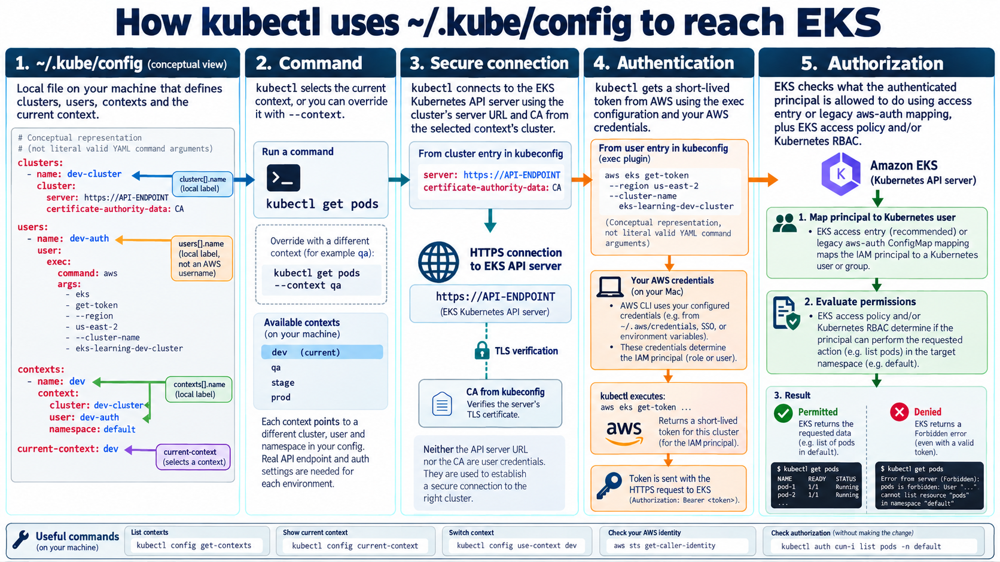
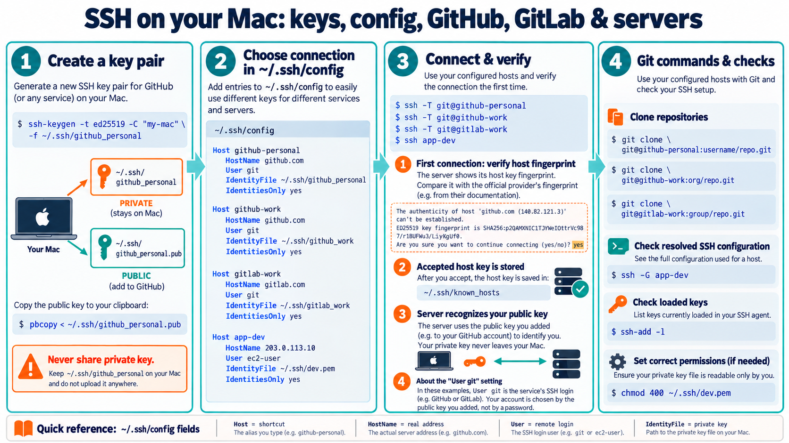

# Understanding `~/.kube/config` and `~/.ssh/config`

A practical guide to how `kubectl`, SSH, and Git choose a destination and authenticate. Examples use two EKS learning clusters and separate GitHub/GitLab keys. Replace example names, account IDs, and paths with your own values.

## 1. The two folders at a glance

| File | Used by | Main question answered |
| --- | --- | --- |
| `~/.kube/config` | `kubectl` and Kubernetes clients | Which cluster should I contact, and how should I authenticate? |
| `~/.ssh/config` | SSH (and Git when using SSH remotes) | Which host should I contact, as which remote user, and with which key? |

`~` means your home directory. A name beginning with `.` is hidden by default. If your shell prompt ends in `.kube %` or `.ssh %`, `cat config` reads the config in that current directory; `cat ~/.kube/config` and `cat ~/.ssh/config` name the files explicitly.

These files are local client settings. Editing a label in either one does not rename an EKS cluster, change a GitHub account, or grant permissions on a remote system.

# Part A: Kubernetes kubeconfig

## 2. What a kubeconfig contains

A kubeconfig typically has `clusters`, `users`, `contexts`, and `current-context`:

```yaml
apiVersion: v1
kind: Config
clusters:
  - name: dev-cluster
    cluster:
      server: https://EXAMPLE.gr7.us-east-2.eks.amazonaws.com
      certificate-authority-data: <existing base64 CA data>
users:
  - name: dev-aws-auth
    user:
      exec:
        apiVersion: client.authentication.k8s.io/v1beta1
        command: aws
        args:
          - --region
          - us-east-2
          - eks
          - get-token
          - --cluster-name
          - eks-learning-dev-cluster
          - --output
          - json
        interactiveMode: IfAvailable
        provideClusterInfo: false
contexts:
  - name: dev
    context:
      cluster: dev-cluster
      user: dev-aws-auth
      namespace: default
current-context: dev
```

This is illustrative: the CA placeholder and example server are not a working configuration. In your original file, the two actual cluster entries are `eks-learning` in `us-east-1` and `eks-learning-dev-cluster` in `us-east-2`. Your displayed `current-context` selected the latter. The cluster ARN strings used as entry names are local identifiers, not proof of the AWS identity you are signed in as.

### `apiVersion` and `kind`

`apiVersion: v1` and `kind: Config` describe the kubeconfig document format. They do not report your cluster's Kubernetes version. Likewise, `client.authentication.k8s.io/v1beta1` under `exec` describes the credential plugin response format, not the cluster version.

### `clusters`: address and server verification

Each `clusters[].name` is a local lookup name. Its `server` is the Kubernetes API endpoint, not an application, pod, or worker node. `certificate-authority-data` is the encoded CA certificate used by the client to verify the server's TLS certificate. The CA identifies a trusted server; it does not identify you to the server. The CA is a certificate, not a private key.

A cluster entry can alternatively use a `certificate-authority` file path. Keep the configured CA and server matched to the real cluster; do not invent either value merely to make the names readable.

### `users`: client authentication instructions

A kubeconfig `user` is a named set of client credentials or instructions. It is not necessarily a human user or a Kubernetes `User` object. In your EKS config, `exec.command: aws` tells `kubectl` to invoke the AWS CLI. The `args` correspond approximately to:

```bash
aws --region us-east-2 eks get-token --cluster-name eks-learning-dev-cluster --output json
```

The AWS CLI uses the credentials available to that process and returns a short-lived token. The config you showed does not specify `--profile`, so the normal AWS CLI credential selection applies, including environment variables and the configured profile. `env: null` means the kubeconfig exec block adds no special environment variables. `interactiveMode: IfAvailable` permits interactive input when available; `provideClusterInfo: false` means cluster metadata is not supplied to the plugin.

The entry's `name` is merely a pointer for contexts. Naming it `dev-aws-auth` does not create an AWS user called `dev-aws-auth`.

### `contexts`: join a cluster and a user

A context points to **one cluster entry**, **one user entry**, and optionally a default `namespace`. In the example, context `dev` refers to `dev-cluster` and `dev-aws-auth`. All these references must match their entry names exactly. With no context namespace, Kubernetes commands normally target the `default` namespace unless overridden by `-n`/`--namespace` or command specific behavior. `kubectl get pods -A` requests pods across namespaces, subject to permissions.

### `current-context`: the default choice

`current-context: dev` selects the context used when you do not provide `--context`. A command-level `--context qa` overrides it for that invocation. `kubectl config use-context qa` changes the local default. These operations do not move workloads between clusters.

## 3. What happens for `kubectl get pods`

1. `kubectl` loads kubeconfig: explicit `--kubeconfig` if given, otherwise `KUBECONFIG` if set, otherwise `~/.kube/config`. `KUBECONFIG` may name multiple files that are merged.
2. It selects the command's `--context`, or the file's `current-context`.
3. The selected context names a cluster and a user. Its namespace is used unless overridden.
4. The cluster entry supplies the API server URL and CA. HTTPS verifies the server against the CA.
5. The user entry obtains authentication material. In your case, `aws eks get-token` creates a token using your effective AWS credentials.
6. EKS verifies the token and identifies the AWS IAM principal. Access entries or a legacy `aws-auth` mapping allow that principal into the cluster according to the cluster's authentication mode.
7. EKS access policies and/or Kubernetes RBAC decide whether that principal can **list pods** in the selected namespace. If allowed, pods are returned; otherwise the API may respond `Forbidden`. Connection or credential failures produce different errors.

The `server` and CA establish **where** and **which server**; the authentication token establishes **who**; authorization rules establish **what that identity may do**. Having a kubeconfig does not itself grant cluster access.

## 4. Inspect and switch contexts

```bash
kubectl config current-context
kubectl config get-contexts
kubectl config get-clusters
kubectl config get-users
kubectl config view --minify
kubectl config view --raw --minify   # May display credentials; keep output private
kubectl config use-context dev
kubectl --context qa get pods -n payments
kubectl auth can-i list pods -n default
aws sts get-caller-identity
```

`aws sts get-caller-identity` shows the AWS identity selected by your current AWS CLI environment. If a kubeconfig entry supplies its own exec environment or profile, reproduce that selection when checking identity. `kubectl auth can-i` asks the selected cluster about one permission; it does not list all AWS account permissions.

## 5. Friendly names for dev, QA, stage, prod

Use distinct context labels such as `myapp-dev-us-east-2`, `myapp-qa-us-east-2`, `myapp-stage-us-east-2`, and `myapp-prod-us-east-1`. A context label can be renamed without renaming its cluster or auth entry:

```bash
kubectl config rename-context \
  'arn:aws:eks:us-east-2:140173112512:cluster/eks-learning-dev-cluster' \
  myapp-dev-us-east-2
kubectl config get-contexts
```

`rename-context` also updates `current-context` if the renamed context was current. This modifies local kubeconfig. There is no corresponding `kubectl config rename-user` command. If you want to rename a user entry, back up the file, change `users[].name`, and change **every** context `user:` reference to match. `kubectl config set-context CONTEXT --user=NEW_NAME` updates one context pointer, but does not copy the old user's `exec` settings into a new entry. Avoid deleting the old entry until references and authentication work.

| Value | Readability change? | Consequence |
| --- | --- | --- |
| `clusters[].name` | Yes | Update every context `cluster:` reference. |
| `users[].name` | Yes | Update every context `user:` reference. |
| `contexts[].name` | Yes | Use `rename-context`; update scripts that use the old name. |
| `current-context` | Yes | Must equal an existing context name. |
| `server`, CA | Only for the real target cluster | Wrong values prevent or misdirect a connection. |
| `--region`, `--cluster-name` | Only for the real EKS cluster | Must match the cluster for token generation. |
| `namespace` | Yes | Changes the default namespace for that context. |

A label `prod` does not make a dev cluster production. Each environment requires its own real cluster information and appropriate access; some organizations also have several environments within one cluster, so use accurate names.

### Adding another real EKS cluster

After obtaining its cluster name, region, account access, and permissions:

```bash
aws eks update-kubeconfig --region us-east-2 --name REAL_QA_CLUSTER --alias myapp-qa-us-east-2
kubectl config get-contexts
```

This fetches actual endpoint and CA information and writes/updates kubeconfig. It may set the added context as current, so check before your next `kubectl` command. AWS access to describe the cluster and Kubernetes access to workloads are separate. With multiple AWS profiles, you can choose a profile when generating the file and configure an appropriate profile or role for later token generation; verify the resulting `users[].user.exec` settings before relying on them.

### Safe edits and troubleshooting

```bash
cp ~/.kube/config ~/.kube/config.backup
kubectl config view --minify
kubectl --context myapp-dev-us-east-2 get pods
```

Check `echo "$KUBECONFIG"` if changes seem to affect a different file. If an API endpoint cannot be reached, check network/VPN and cluster endpoint access. If you see a credential error, check the AWS CLI identity and token command. If you see `Forbidden`, check the EKS access entry or legacy mapping and the associated access policy/RBAC permissions. Avoid sharing `--raw` config output publicly; kubeconfig can contain secrets in other authentication setups.

# Part B: SSH configuration

## 6. Typical files in `~/.ssh`

| File | Purpose |
| --- | --- |
| `config` | Per-destination SSH connection settings. |
| `id_ed25519`, `id_ed25519_gitlab`, `ansible-lab` | Example private keys. Never paste or publish their contents. |
| Matching `.pub` files | Public keys to register with the account or install on a server. |
| `known_hosts` | Trusted host key records used to detect an unexpected server key. |
| `known_hosts.old` | An older backup of host key records; not the active default. |
| `agent/` | Local agent-related data, depending on the setup. |

A private/public key pair is linked mathematically. The public key can be registered with GitHub or GitLab; the private key stays on your Mac. SSH proves possession of the private key without sending it to the server. `known_hosts` works in the other direction: it helps your Mac verify the **server**. The server's host key is distinct from your account's public key.

## 7. Read your GitHub and GitLab host rules

Your screenshot shows GitHub using `~/.ssh/id_ed25519` and GitLab using `~/.ssh/id_ed25519_gitlab`:

```sshconfig
Host github.com
    HostName github.com
    User git
    AddKeysToAgent yes
    UseKeychain yes
    IdentityFile ~/.ssh/id_ed25519
    IdentitiesOnly yes

Host gitlab.com
    HostName gitlab.com
    User git
    AddKeysToAgent yes
    UseKeychain yes
    IdentityFile ~/.ssh/id_ed25519_gitlab
    IdentitiesOnly yes
```

| Directive | What it does |
| --- | --- |
| `Host` | Pattern/alias matched against the destination you type. Can contain multiple names or wildcards. |
| `HostName` | Actual DNS name or IP address to contact. |
| `User` | Remote SSH login name; GitHub and GitLab normally use `git`. |
| `IdentityFile` | Path to the private key SSH should try. |
| `IdentitiesOnly yes` | Limits offered authentication identities to configured ones, even if the agent holds more. |
| `AddKeysToAgent yes` | Allows SSH to load the key into the local SSH agent. |
| `UseKeychain yes` | Apple OpenSSH setting to use macOS Keychain for a key passphrase. |

Other useful directives include `Port 22` (remote SSH port), `ProxyJump bastion-alias` (connect through a jump host), `ServerAliveInterval 30` (send keepalive requests), and `ForwardAgent` (agent forwarding; enable only where specifically needed). A broad `Host *` block can set defaults. SSH config is not YAML; write `Host example`, not `Host: example`.

### Why `HostName gitlab.com` has `User git`

`HostName` is **where** SSH connects. `User` is **the login name requested on that server**. GitLab and GitHub normally provide a shared SSH login named `git` for Git operations. Your personal account name is determined from the public key you registered with the service. Thus `ssh gitlab.com` with the rule above is effectively `ssh git@gitlab.com`; it does not log in to an account named `gitlab-username` on the server. The repository URL uses `gitlab-username` as a repository namespace, for example `git@gitlab.com:gitlab-username/my-repo.git`. If a group owns the repository, its group path replaces that namespace. The service then checks that the account associated with your key has repository access.

## 8. Host aliases and account usernames

Assume your GitHub account is `github-username`, your GitLab account is `gitlab-username`, and their respective public keys have been added to those accounts. You can use readable aliases:

```sshconfig
Host github-work
    HostName github.com
    User git
    IdentityFile ~/.ssh/id_ed25519
    IdentitiesOnly yes

Host gitlab-work
    HostName gitlab.com
    User git
    IdentityFile ~/.ssh/id_ed25519_gitlab
    IdentitiesOnly yes
```

Then test and clone:

```bash
ssh -T github-work
# GitHub's successful authentication greeting identifies github-username.
git clone git@github-work:github-username/my-repo.git

ssh -T gitlab-work
# GitLab's greeting identifies gitlab-username.
git clone git@gitlab-work:gitlab-username/my-repo.git
```

In `git@github-work:github-username/my-repo.git`:

- `git` is the SSH service login, not your personal account name.
- `github-work` is the local alias; `HostName` resolves it to `github.com`.
- `github-username/my-repo.git` is the repository namespace and name. A repository in an organization uses that organization's namespace instead.
- The public key registered with the service identifies which account is authenticating; repository permissions decide whether that account may clone or push.

`ssh -T` tests SSH authentication without requesting an interactive shell. Some Git hosting services return a nonzero shell exit status even after a successful greeting, because they do not provide shell access; read the message rather than using the exit code alone.

If you replace `Host github.com` with `Host github-work`, old remotes using `git@github.com:...` will no longer match that rule. Preserve both names if both URL styles are needed:

```sshconfig
Host github.com github-work
    HostName github.com
    User git
    IdentityFile ~/.ssh/id_ed25519
    IdentitiesOnly yes
```

Check and update a Git remote if desired:

```bash
git remote -v
git remote set-url origin git@github-work:github-username/my-repo.git
```

## 9. What can you rename in SSH config?

| Value | Changeable? | What must also change? |
| --- | --- | --- |
| `Host github-work` | Yes | Use the alias in `ssh` or Git URLs, or keep the original host pattern too. |
| `HostName github.com` | Only for a different real destination | It must resolve to the intended server. |
| `User git` | Only if the destination expects another remote login | Do not put your GitHub/GitLab account username here for their normal SSH service. |
| `IdentityFile` path | Yes | Move/rename the actual private key to match; keep its public key paired. |
| Key filename | Yes | Update all SSH config references and key management scripts. |
| `Port` | Yes | Must match the remote server's listening port. |
| Directive names | No | `HostName`, `IdentityFile`, etc. are SSH's syntax. |

An EC2 host is different: its `User` is an actual operating-system account, such as `ec2-user` on many Amazon Linux instances or `ubuntu` on many Ubuntu instances. A downloaded `.pem` file is often the private key from an EC2 key pair. SSH accepts the `.pem` extension directly; use its actual path in `IdentityFile`. For example:

```sshconfig
Host my-ec2
    HostName 203.0.113.10
    User ec2-user
    Port 22
    IdentityFile ~/.ssh/my-ec2-key.pem
    IdentitiesOnly yes
    ServerAliveInterval 30
    ServerAliveCountMax 3
```

The IP is documentation-only: replace it with your reachable public or private IP/DNS name. Save the private `.pem` file at the stated path and restrict it with `chmod 400 ~/.ssh/my-ec2-key.pem`; then connect with `ssh my-ec2`. If the key remains in Downloads, you may instead use `IdentityFile ~/Downloads/my-ec2-key.pem` and set permissions there. Do not use a `.pub` file as `IdentityFile`. `ServerAliveInterval 30` checks an idle connection every 30 seconds, and `ServerAliveCountMax 3` disconnects after three unanswered checks. EC2 security-group/network access, the server-side login account, and the matching authorized public key must also be correct.

For a private instance reached through a bastion, add two host blocks:

```sshconfig
Host bastion
    HostName BASTION_PUBLIC_IP
    User ec2-user
    IdentityFile ~/.ssh/bastion.pem
    IdentitiesOnly yes

Host private-ec2
    HostName PRIVATE_EC2_IP
    User ec2-user
    IdentityFile ~/.ssh/private-ec2.pem
    IdentitiesOnly yes
    ProxyJump bastion
```

`ssh private-ec2` connects through `bastion`. Replace the placeholders with actual addresses and use whichever key is authorized on each host. To see the effective connection settings before connecting, run `ssh -G my-ec2 | grep -E '^(hostname|user|port|identityfile|proxyjump|serveraliveinterval) '`.

## 10. SSH authentication and server verification

1. You invoke `ssh github-work` or Git invokes SSH for an SSH-format remote URL.
2. SSH matches `Host github-work`, connects to `HostName github.com`, and uses `User git`.
3. Your client verifies the server's host key using `known_hosts` or an approved host-key verification method. A surprising host-key change should be investigated before accepting it.
4. Your client offers the public-key identity and proves it holds the configured private key. The private key itself is not sent.
5. GitHub or GitLab maps the public key to an account and checks repository authorization. Authentication success does not guarantee access to every repository.

An SSH key passphrase protects your private key on disk. The SSH agent can hold an unlocked key for reuse; macOS Keychain can assist with the passphrase. These do not change which remote account owns the public key.

## 11. Inspect and troubleshoot SSH safely

```bash
ls -la ~/.ssh
ssh -G github-work | grep -E '^(hostname|user|port|identityfile|identitiesonly) '
ssh -T github-work
ssh -vT github-work         # Detailed connection diagnostics; review before sharing
ssh-add -l                # Keys currently loaded in the agent
ssh-keygen -lf ~/.ssh/id_ed25519.pub
```

If SSH says `Permission denied (publickey)`, verify the matching public key is registered with the intended account, the configured private key exists, and the host alias matches the Git URL. If a key is rejected due to permissions, set appropriate local permissions:

```bash
chmod 700 ~/.ssh
chmod 600 ~/.ssh/config ~/.ssh/id_ed25519 ~/.ssh/id_ed25519_gitlab
chmod 644 ~/.ssh/id_ed25519.pub ~/.ssh/id_ed25519_gitlab.pub
```

Apply permissions only to files that actually exist. Never disable host key checking simply to suppress a mismatch. Keep private keys, access tokens, and sensitive kubeconfig material out of repositories and public messages.

## 12. Final comparison

| Action | Kubeconfig | SSH config |
| --- | --- | --- |
| Select readable shortcut | Context `myapp-dev-us-east-2` | Host alias `github-work` |
| Choose remote server | Context points to cluster `server` | Alias points to `HostName` |
| Verify remote server | Cluster CA certificate | Server host key in `known_hosts` |
| Identify client | EKS token obtained with AWS credentials | Proof using the configured SSH private key |
| Grant actions | EKS access policy and/or Kubernetes RBAC | Server account/repository permissions |
| Choose default | `current-context` | The destination in your `ssh` command or Git remote URL |

Both files simplify choosing connections, but neither file alone grants access. Always verify the selected target before running a command that changes resources.

## 13. Illustrated guide and command walkthrough



**Kubeconfig diagram:** Read it from left to right. The file's `current-context` chooses a context, which links a cluster entry and a user entry. `kubectl` uses the cluster's API URL and CA to reach and verify EKS, then runs the user entry's AWS token command. EKS identifies the AWS principal and checks permission for the requested action. The diagram's endpoint, CA, names, output, and host details are illustrative; the YAML shown there is conceptual rather than a complete file to paste. Detailed explanations and working syntax follow in Part A.



**SSH diagram:** Read it from left to right. Create a key pair, register its `.pub` file with the service, use `~/.ssh/config` to select the destination and private key, verify the server's host key on first contact, and then run SSH or Git commands using the alias. The host-key fingerprint and IP displayed in the illustration are examples, **not values to trust or connect to**. Compare a real fingerprint with the provider's official published fingerprint. The commands and fuller explanations follow in Part B.

If you downloaded only this Markdown file, download the two images into an `images/` directory next to it, or use the accompanying ZIP, so the illustrations render locally.


### Reading the kubeconfig picture, panel by panel

1. **Config:** `clusters[].name`, `users[].name`, and `contexts[].name` are local lookup names. A context's `cluster:` and `user:` fields point to those entries. `current-context` points to the chosen context. A kubeconfig user name is not your AWS username.
2. **Command:** `kubectl get pods` normally uses `current-context`; `kubectl get pods --context qa` selects `qa` for only that command. The picture shows four environment labels, but each works only when real connection and auth entries have been configured.
3. **Secure connection:** The API server URL tells the client where to send the HTTPS request. The CA verifies the API server's TLS certificate. It does not prove who the client is.
4. **Authentication:** The exec user entry calls `aws eks get-token` for the selected EKS cluster. The AWS CLI chooses credentials from its effective configuration, which may include a profile, environment variables, or SSO. `kubectl` presents the short-lived token, and EKS identifies the underlying IAM principal. The diagram shows a conceptual command layout; use the actual `exec.args` array in the YAML example above.
5. **Authorization:** Access entries or the legacy `aws-auth` mapping connect an IAM principal with cluster access. EKS access policies and/or Kubernetes RBAC evaluate the specific verb, resource, and namespace, such as `list pods` in `default`. Allowed requests return pods; a valid identity without that permission receives `Forbidden`.

The commands along the bottom of the picture inspect contexts, switch the local default, show the AWS CLI identity, and ask the cluster whether the selected identity can list pods. They do not themselves grant access.


### Reading the SSH picture, panel by panel

1. **Create a key pair:** `ssh-keygen -t ed25519 -C "my-mac" -f ~/.ssh/github_personal` creates `github_personal` (private) and `github_personal.pub` (public). The comment is a label, not the GitHub account name. If your existing `id_ed25519` pair is already registered and working, you do not need to generate a replacement. `pbcopy < ~/.ssh/github_personal.pub` copies only the public key on macOS. In GitHub, add it under **Settings → SSH and GPG keys → New SSH key** as an authentication key.
2. **Choose a host:** Separate `Host` aliases can point to the same `HostName github.com` while selecting different `IdentityFile` keys for personal and work accounts. Another alias can point to GitLab, and `app-dev` can point to an EC2 server using a `.pem` private key. `User git` is the Git hosting SSH service login; the registered key selects your account. For EC2, `User ec2-user` is an operating-system login. `IdentitiesOnly yes` reduces attempts with unrelated keys.
3. **Connect and verify:** The first SSH connection may display the server's host-key fingerprint. Check the real fingerprint against the provider's official documentation before accepting it. The trusted server host key is then recorded in `~/.ssh/known_hosts`. Your client proves possession of the private key without sending the private key. The server maps your public key to the Git account or an authorized server login. The fingerprint printed in the picture is only illustrative.
4. **Use commands:** `ssh -T git@github-personal` tests GitHub authentication; `ssh app-dev` logs in to the configured server. A Git URL such as `git@github-work:org/repo.git` uses `github-work` as the host alias and `org/repo.git` as the repository path. `ssh -G app-dev` prints resolved connection settings, `ssh-add -l` lists agent-loaded keys, and `chmod 400 ~/.ssh/dev.pem` restricts that private key's permissions.

The diagram's four sample host blocks are separate choices, not four accounts automatically created by SSH. The corresponding public keys must be registered with the proper Git accounts or authorized on the proper server, and the actual remote permissions still apply.


### Commands in the pictures, ready to adapt

**Kubernetes (your EKS workflow):**

```bash
kubectl config get-contexts                 # List configured contexts
kubectl config current-context             # Show selected context
kubectl config use-context dev              # Select an existing context named dev
kubectl get pods -n default                 # Query the selected cluster
kubectl get pods --context qa -n default    # Use qa for this command only
aws sts get-caller-identity                 # Show effective AWS CLI identity
kubectl auth can-i list pods -n default     # Ask whether list pods is allowed
```

The `dev` and `qa` context names are examples. Use names returned by `kubectl config get-contexts`; the AWS identity command must use the same AWS profile/environment as the kubeconfig exec command to describe that command's actual identity.

**SSH key generation, registration, and connection on macOS:**

```bash
ssh-keygen -t ed25519 -C "my-mac" -f ~/.ssh/github_personal
pbcopy < ~/.ssh/github_personal.pub       # Paste into GitHub's SSH key settings
ssh -T git@github-personal                  # Test the matching Host alias
ssh -T git@github-work                      # Test another GitHub key/account
ssh -T git@gitlab-work                      # Test GitLab key/account
git clone git@github-personal:username/repo.git
ssh app-dev                                 # Log in to configured EC2 host
ssh -G app-dev                              # Display resolved SSH options
ssh-add -l                                  # List loaded agent keys
chmod 400 ~/.ssh/dev.pem                    # Restrict EC2 private key
```

Before using the alias commands, create matching `Host` blocks in `~/.ssh/config` and register each corresponding public key with the intended service/account. If you already have a working key pair, reuse it instead of overwriting it. For the first connection to a host, compare the displayed host-key fingerprint with the provider's published value before accepting it. The illustrative IP and fingerprint in the pictures must not be used as real connection data.
